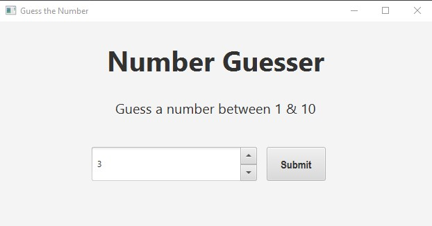
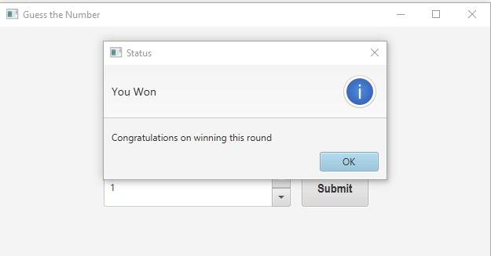
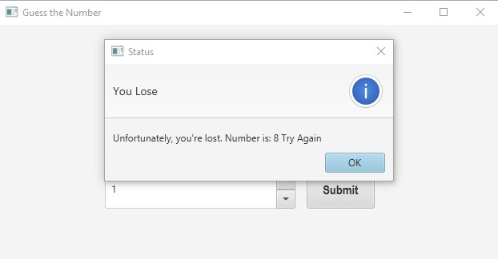

# Number Guesser
A mini Game Project, created with **JavaFx & Scene Builder**   

## Screenshots
Main
 :-------------------------:
   

Win          | Lose
:-------------------------:|:-------------------------:
  |  

## Installation 🔌
1. Press the **Fork** button (top right the page) to save copy of this project on your account.

2. Download the repository files (project) from the download section or clone this project in your PC by using clone command or downloading zip file.

3. Imported it in Intellij IDEA or any other Java IDE & Add VM arguments of JavaFx.

4. Run the application :D

## Contributing 💡
If you want to contribute to this project and make it better with new ideas, your pull request is very welcomed.
If you find any issue just put it in the repository issue section, Thank you.

.سبحَانَكَ اللَّهُمَّ وَبِحَمْدِكَ، أَشْهَدُ أَنْ لا إِلهَ إِلأَ انْتَ أَسْتَغْفِرُكَ وَأَتْوبُ إِلَيْكَ
